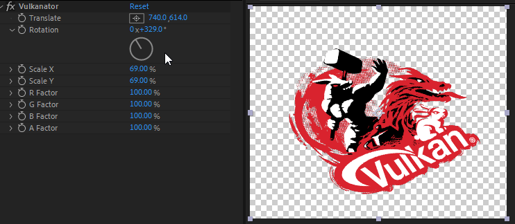

# Vulkanator 

Vulkanator is a sample project that demonstrates integrating the Adobe After Effects plugin SDK as Vulkan GPU acceleration in the form of a trivial plugin.
The [Adobe After Effects plugin SDK](https://developer.adobe.com/after-effects/) provides a sample-project called `GLator` to demonstrate how to integrate OpenGL into a native After Effects plugin. In the same spirit, **Vulkan**ator demonstrates the same thing, but utilizing Vulkan.

## Dependencies

 * [Cmake 3.7.0+](https://www.cmake.org/download/)
 * [Vulkan SDK](https://vulkan.lunarg.com/)
 * [Adobe After Effects plugin SDK](https://developer.adobe.com/after-effects/)

## Building

Clone the repository with submodules:

`git@github.com:Wunkolo/Vulkanator.git`

Download the [Adobe After Effects plugin SDK](https://developer.adobe.com/after-effects/) and extract the required library folders into `extern/Adobe After Effects SDK`.

See [extern/Adobe After Effects SDK](extern/Adobe%20After%20Effects%20SDK/README.md) for more information.

### Windows

#### Visual Studio

Ppen `CMakeLists.txt` using Visual Studio's [built-in support for opening CMake projects](https://blogs.msdn.microsoft.com/vcblog/2016/10/05/cmake-support-in-visual-studio/) and build.

The compiled plugin will be found in `build/bin/{Debug,Release}/Vulkanator.aex`

#### Visual Studio Code

With the [CMake Tools extension](https://marketplace.visualstudio.com/items?itemName=ms-vscode.cmake-tools) and 
[C/C++ extensions](https://marketplace.visualstudio.com/items?itemName=ms-vscode.cpptools), open the top level folder as a cmake-project and build.
The compiled plugin will be found in `build/bin/Vulkanator.aex`

### OSX

_Coming soon_